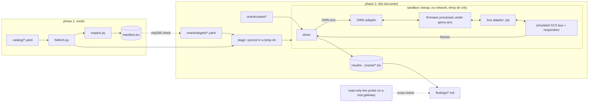

# Oracle architecture (phase 2)

Phase 1 turns a firmware image into a verified `manifest.tsv`. Phase 2 runs
the gateway's own translator programs against a simulated SCS bus and records
what they do. The records are TSV files; findings cite rows in them.

This document fixes the moving parts, the boundaries between them and the
order in which they get built. The code under `oracle/` follows it.

## 1. Questions the oracle answers

| Direction | Input | Observed | Example question |
|---|---|---|---|
| **down** | an OpenWebNet frame sent to the gateway | the gateway's reply (`ACK` / `NACK` / none) and every bus frame it emits | Does `*#1*31*#1*100*0##` reach the bus? (gdluck: no) |
| **up** | a bus frame injected on the simulated bus | every OpenWebNet frame the gateway emits on its event side | Which bus frame makes `bt_luci` emit `*1*19*31##`? |
| **sequence** | an ordered mix of down and up steps | the same, per step | After a WHAT 19 event, what does `*#1*31##` return? |

Every answer is a **firmware fact** about one image: it says what that
firmware does, not what the plant does. gdluck's caveat holds here too: a
silent bus can mean "no device answered", so a missing reply proves nothing
on its own; an emitted frame does.

What the oracle **cannot** answer: what a WHO 1001 DIM 11 mask bit *means*.
The actuator sets those bits; the gateway only translates them. The oracle
can show which injected bus bits come out at which mask position. A finding
may say "position N is set iff stimulus S" only when a row shows that toggle;
positions that never flip stay unresolved. Positions are numbered 1-based
from the left, the convention `EVID-MH200-WHAT19-FAULT` uses ("bits 6 and 21
cleared" in `111110111111111111110111`).

### 1.1 Which evidence wins

Live evidence outranks the oracle, and the oracle outranks OWNd, **for the
product and firmware the evidence was captured on**. A disagreement is written
down as a `diverge`; it never rewrites a capture. The first live anchor,
`EVID-MH200-WHAT19-FAULT`, was captured on an **MH200 running firmware
2.1.0**, while the first image here is **MH200N 1.1.8**: a different product
and firmware. Rows checked against it are cross-product until an MH200 2.1.0
image is in the catalog, and the check says so.

Suites only use addresses that are already public (`74` from that capture);
other installation-specific WHEREs stay out of the repo.

## 2. Constraints

1. **Ground rules (README).** Black-box first: we run the programs and watch
   their inputs and outputs. No disassembly, no decompiled code, no vendor
   bytes in the repo or in CI artifacts. `tools/guard.py` stays the backstop,
   and also refuses any file containing a NUL byte, so a blob renamed to
   `.tsv` cannot slip through.
2. **Reproducible.** The same image, target, harness and case file give a
   byte-identical TSV. No timestamps, no PIDs, no ports in a record.
3. **Runs where the firmware may run.** Locally, or in the protected
   `firmware` environment on `main` (`oracle.yml`). Never on a fork PR.
4. **Untrusted code.** The firmware is 2012 ARM userland we did not write. It
   runs in a sandbox with no network and no host filesystem beyond its own
   staged copy.
5. **Per image, comparable across images.** The same case file runs against
   every catalogued gateway, so a diff of two TSVs is a diff of two firmwares.

## 3. System overview



| Component | Module | Firmware needed? | Built |
|---|---|---|---|
| Target spec | `oracle/target.py`, `oracle/targets/` | no (checks hashes against the manifest) | 2a |
| Case files | `oracle/cases.py`, `oracle/cases/` | no | 2a |
| Sandbox + jail command lines | `oracle/sandbox.py` | no (builds argv only) | 2a |
| Boundary discovery | `oracle/discover.py`, `oracle/run.py discover` | yes, to produce the trace; parser is not | 2a |
| Simulated bus, framers, responders | `oracle/bus.py` | no | 2a |
| Driver loop | `oracle/driver.py` | no (talks to a `Target` protocol) | 2a |
| Recorder | `oracle/record.py` | no | 2a |
| Stage (sysroot) | `oracle/stage.py` | yes (unit-tested on synthetic archives) | 2a |
| `QemuTarget` (real adapters) | `oracle/qemu_target.py` | yes | 2b |
| Live cross-check | `tools/live_probe.py` | no (needs a real gateway) | 2c |

Everything marked "no" is unit-tested in `pr.yml` on synthetic fixtures, like
phase 1.

## 4. The two cut points

The firmware has two edges we must replace: where OpenWebNet text comes in,
and where SCS bytes go out. Picking those cuts is the main design decision.

### 4.1 What the MH200N 1.1.8 manifest shows

From `results/MH200N/010108/manifest.tsv` (file names and types only):

* translators in the app zip: `bt_luci`, `bt_device`, `bt_termo`, `bt_multi`,
  `bt_lighting`, `bt_alarm`, `bt_energia`, `bt_supervisione`, …;
* `scsserver` and `libopenscs.so.0.0` in both the app zip and the recovery
  rootfs;
* `cfg/stack_open.xml` (application) and `cfg/conf.xml` (recovery):
  configuration, likely the wiring between those processes;
* kernel `2.4.19-rmk7-pxa2-btweb`: ARM, XScale PXA2xx, no hardware FPU.

The working hypothesis was: translators link `libopenscs` and talk to
`scsserver`; `scsserver` owns the device node that reaches the bus
transceiver. Discovery (section 5) confirmed it by observation: `scsserver`
opens `/dev/ttyPIC` and serves TCP 20001, and `bt_luci` / `bt_device` connect
to 127.0.0.1:20001.

### 4.2 Bus side

| Option | How | Faithful | Cost | Verdict |
|---|---|---|---|---|
| **B1 hardware cut** | run the vendor `scsserver` too; the device node it opens is a symlink in the staged sysroot to a pty we own | highest: the vendor `scsserver` stays in the loop | learn the transceiver byte stream from what `scsserver` writes | **default** |
| B2 socket cut | replace `scsserver` with our own server speaking the client protocol of `libopenscs` | loses `scsserver` behaviour | re-implement a vendor IPC protocol | fallback if B1 needs hardware we cannot fake (ioctls with no file equivalent) |
| B3 libc shim | `LD_PRELOAD` shim wrapping libc `open` / `ioctl` / `read` / `write` for the bus device only | high; also keeps the boundaries of each `write()` | an ARM **OABI** cross-toolchain for a 2002-era libc; still runs inside `qemu-arm` | fallback when discovery shows ioctls a pty cannot answer |
| B4 vendor-library cut | shim replacing `libopenscs` functions | — | needs the library's function signatures, i.e. reading the binary | **rejected** (ground rules) |
| B5 system emulation | `qemu-system-arm` booting the 2.4.19 PXA kernel with a modelled bus device | highest | a PXA board model plus a device model for the bus hardware | not v1 |

The pty trick: the firmware jail makes the staged sysroot the root directory
and bind-mounts the slave of a pty we hold at the device path the target spec
names, so `/dev/ttyPIC` opened by the guest is our pty. (`qemu-arm -L` was
the first plan, but it falls back to the HOST path when a file is missing in
the prefix: the first trace read the host's `ld.so.cache` that way.) The
foreign binary runs through the kernel's binfmt_misc entry for its CPU,
registered with the `F` flag so it works inside the new root. If the program
issues termios ioctls, a pty answers them like a UART.

Every option runs the ARM binary under `qemu-arm` on an x86 host, a shim
included: an `LD_PRELOAD` library is guest code too. So the order is pty
first (no guest code of ours), libc shim second, never "shim instead of
qemu". The adapter that produced a row is in its header, so a pty result is
never silently compared with a shim or system-emulation one. gdluck's
`oracle2/`, if published, fits as one more adapter behind the same `Target`
protocol.

### 4.3 OpenWebNet side

| Option | How | When |
|---|---|---|
| **O1 full stack** | boot every process the init scripts start; connect to TCP 20000 inside the sandbox's network namespace like OWNd does (command and event sessions) | default: tests routing, sessions and ACK/NACK exactly as a client sees them |
| O2 unit | start one translator; feed it on whatever channel it reads OWN text from | when the full stack does not boot under emulation (gdluck could not emulate `openserver` on MyHOMEServer1) |

The harness used is part of every record's header (`harness=full` or
`harness=unit:<binary>`), because the answers can differ: a frame `openserver`
rejects never reaches a translator.

## 5. Boundary discovery (phase 2a, done for MH200N 1.1.8)

```bash
IMG=$(python tools/fwfetch.py catalog/MH200N/010108.yaml)
python -m oracle.run discover oracle/targets/MH200N/010108.yaml \
    --image "$IMG" --program scsserver          # --seconds 10 by default
```

`discover` stages the target's sysroot (`oracle/stage.py`, section 6.1), runs
one program in the firmware jail for a fixed window with qemu's syscall trace
on (one file per process, so concurrent programs never interleave), holds the
master side of a pty for every device the target declares, and writes
`results/<product>/<version>/oracle/boundary/<program>.tsv`: the trace reduced
by `oracle/discover.py`, every distinct burst written to a device (split at
CR by `LineFramer`, independent of scheduling), and how the run ended.
Nothing is sent to the program; discovery only listens. A real row:

```
# product=MH200N
# version=010108
# image_sha256=e32d…
# program=scsserver
# target_sha256=c6a6…
# emulator=qemu-arm-8.2.2
# kernel_release=2.4.19
# window_s=10
# oracle_version=1
kind	detail	result
bind	inet:0.0.0.0:20001	ok
ioctl	/dev/ttyPIC TCSETS iflag=IGNPAR|IXON|IXOFF cflag=B38400,CS8,CREAD|CLOCAL	ok
open	/dev/ttyPIC O_RDWR|O_NOCTTY|O_NONBLOCK	ok
write	/dev/ttyPIC	$24\x0d
```

fd numbers, PIDs and pointers are dropped, results become `ok` or an errno
name, facts are de-duplicated and sorted: two passes over all five MH200N
programs gave byte-identical files. These are observations of behaviour
(which files, sockets and ioctls a program uses), not code. They decide B1
vs B2 and O1 vs O2 and fill the `boundary:` block of
`oracle/targets/<product>/<version>.yaml`; until it is filled, a target cannot
run cases (`target.py` refuses).

### 5.1 What the MH200N 1.1.8 records show

| Program | Observed |
|---|---|
| `scsserver` | opens `/dev/ttyPIC`; the pty answers `TCGETS` / `TCSETS` (38400 8N1, `IXON|IXOFF`) / `TCFLSH`; listens on TCP 20001; writes five short ASCII commands to the PIC (`$24` CR, `$020000` CR, …) |
| `bt_luci` | listens on 30001 and 40001; connects to 127.0.0.1:20001 |
| `bt_device` | listens on 30013 and 40013; connects to 127.0.0.1:20001 |
| `openserver` | connects to 127.0.0.1:40001 (`bt_luci`) — alone, refused |
| `bt_processi` | starts `cfg/stack_open.xml`'s p0..p2 (`openserver`, `scsserver`, `bt_device`): `openserver` then **listens on TCP 20000**, connects to `bt_device` on 40013, `bt_device` reaches `scsserver` |

So the target is `bus: pty` (B1) and `own: full` (O1). Two loose ends for 2b:
`bt_processi` does not start `bt_luci` (the harness has to), and under the
full stack one `TIOCMGET` on `/dev/ttyPIC` fails with `ENOTTY` — a pty has no
modem lines, and `stack_open.xml` sets `<rts_alim>1`. If the PIC handshake
depends on it, the libc shim (B3) is the fallback.

Emulation risks, as they turned out:

* **OABI.** The binaries are `ELF/ARM/…/oabi`; `qemu-arm` 8.2.2 runs them
  through its OABI path. Confirmed: every program ran its window.
* **FPA floats.** No `SIGILL` in any window, but nothing shows an FPA code path
  ran either; still open.
* **Kernel version checks.** `QEMU_UNAME=2.4.19` makes `uname` report the
  original release.
* **Libraries.** The image has no `ld.so.cache`; the app's libraries live only
  in `/home/bticino/lib`, so the target sets `LD_LIBRARY_PATH` (runtime block,
  each value cited from the image).
* **Hardware the bus does not cover**: `/dev/nvram`, `/dev/wd`,
  `/proc/sys/dev/btweb/*` are missing (`ENOENT`) and no program died of it in
  the window. Each can get a file, a pty or `/dev/null` in the runtime block
  once a record shows it matters. A program that needs more is a B2 / O2 case.

## 6. Components

### 6.1 Target spec (`oracle/targets/<product>/<version>.yaml`)

Names the programs to run and pins each one to a manifest row by path and
SHA-256. `target.py` loads it, validates every name and checks every hash
against the committed `manifest.tsv`, so a TSV can never claim a binary the
manifest does not contain.

```yaml
product: MH200N
version: "010108"
sysroot:                         # layers overlaid in order, by manifest prefix
  - "…/ubtweb_only.gz~payload~gunzip:"   # rootfs
  - "…/btweb_app.zip!"                   # application
programs:
  bt_luci:   { path: home/bticino/bin/bt_luci,   sha256: 1ef8… }
  scsserver: { path: home/bticino/bin/scsserver, sha256: c6a6… }
runtime:                         # what the device's boot sets up, cited
  cwd: /home/bticino
  env: { LD_LIBRARY_PATH: /home/bticino/lib }
  devices: { /dev/ttyPIC: pty }
boundary: { status: discovered, bus: pty, own: full }
```

The emulator is not configured: it follows from the programs' ELF tags in the
manifest (`ELF/ARM/…` → `qemu-arm`), and all programs of a target must agree.

**Staging** (`oracle/stage.py`) rebuilds the sysroot from the image with phase
1's own walker (`unpack.walk(..., sink=)`), so there is no second extractor.
Every member must match its manifest row and every row under a sysroot layer
must turn up; a mismatch means the manifest is stale. Member names are
untrusted: `..`, empty components and NULs are refused, nothing is written
through a symlink, and link targets are re-rooted inside the sysroot, so an
absolute `/lib/libc.so.6` never resolves on the host. Empty directories
(`/var/run`, …) are manifest `dir` rows since tool version 4, so the staged
tree has them.

### 6.2 Sandbox (`oracle/sandbox.py`)

The **firmware jail** (`jail`, used by discovery):

* `bwrap --unshare-all --die-with-parent --new-session --clearenv`: no
  network beyond a private loopback, no IPC, own PID namespace;
* the staged sysroot is `/`: nothing of the host is visible, so every guest
  path resolves inside the firmware tree. It is a throwaway copy under the
  run's work dir, mounted writable (programs write `/var/name`, logs, ...),
  and deleted after the run like `unpack.py` does;
* device nodes the target names are bind-mounted from ptys the driver holds;
* the CPU comes from binfmt_misc (`qemu-<arch>` with the `F` flag, checked
  before a run); `QEMU_UNAME` and `QEMU_STRACE` are passed in the environment
  so children of a supervisor are traced too.

The **driver jail** (`wrap`, 2b) puts one `bwrap` around the whole suite run
(driver + firmware) with an unshared network namespace (`--unshare-all`), so the
driver can reach the firmware's loopback sockets without exposing host network
interfaces or allowing egress traffic: host `/usr`, `/lib*` read-only, the work
dir read-write, nothing else. The firmware daemons run inside the driver jail
sharing its private loopback (`--share-net`). Each `reset=each` step gets a fresh
sysroot copy restored from the staged baseline.


### 6.3 Simulated bus (`oracle/bus.py`)

* **`Port`**: bytes in and out of the bus adapter (a pty master in production,
  a queue in tests).
* **`Framer`**: splits the byte stream into frames. `IdleGapFramer` (a frame
  is a burst followed by silence) assumes nothing about SCS. `DelimitedFramer`
  (start/end bytes; the community `A8 … A3` framing) is a hypothesis a finding
  has to earn, like any checksum; the core has no SCS parser. `LineFramer`
  (CR / LF ends a frame, NUL padding dropped) fits what discovery saw on the
  MH200N: `scsserver` talks to a PIC in short ASCII commands, so the bytes on
  `/dev/ttyPIC` are not raw SCS frames. Unlike an idle gap it does not depend
  on scheduling. A pty loses the boundaries between the firmware's `write()`
  calls, which is one reason to fall back to the libc shim.
* **`Responder`**: the simulated devices on the bus. `Silent` (no device),
  `AckAll` (every frame acknowledged), and scripted responders that answer
  status requests for a given address. The responder is part of the record
  header, because "no device answered" changes what firmware does.
* **`Bus`**: logs every frame with a sequence number and a direction
  (`gw>bus`, `bus>gw`), injects frames, and `settle()`s: polls until no byte
  has moved for `quiet_ms`, or `max_ms` passed. Time comes from an injected
  clock so tests run instantly.

Raw bytes are the evidence. Decoding SCS bytes into fields is a separate,
optional layer of our own; a finding that relies on a decode says so.

### 6.4 Case files (`oracle/cases/<suite>.cases`)

Plain text, one step per line, committed:

```
; lights: point on/off with speed (gdluck fix 7)
down  *1*0*31##
down  *#1*31*#1*100*0##
up    a8 31 00 12 01 22 a3
```

* `down` takes OpenWebNet text, `up` hex bytes, `;` starts a comment (`#` is
  part of OpenWebNet).
* Malformed frames are allowed on purpose: what the firmware does with them is
  a fact too. A line only has to be TSV-safe printable ASCII.
* A step is identified by `(direction, input)`, not its line number, so
  editing a suite does not renumber the others. Duplicates are an error.
* Large grids (every WHAT × address form) are produced by a generator script
  and the **output** is committed, so a suite is always reviewable text.
* A sequence suite (`.seq`) keeps the steps in order and records them as one
  unit; ordinary suites are independent steps, sorted in the record.

### 6.5 Driver (`oracle/driver.py`)

Runs a suite against anything implementing the `Target` protocol
(`send_own`, `inject_bus`, `settle`, `alive`, `restart`):

1. clear the bus log, perform the step, `settle()`;
2. collect the gateway's reply and every frame emitted since the step;
3. classify: `out` (something emitted), `silent`, `crash` (process died →
   restart before the next step), `timeout` (still busy at `max_ms`);
   in a `.seq`, every step after a crash is `skipped`;
4. hand the row to the recorder. Outputs are tagged by side, `bus:<hex>` or
   `own:<frame>`, so one row shows both what reached the bus and what the
   gateway said on its event side.

Output produced while a program boots belongs to no step and is drained
before the first one.

Each independent step gets a fresh process (`reset=each`, the default), so
no step can see state another left behind. Sharing a process across N steps
(`reset=batch-N`) is faster under qemu but is allowed only once the
reset-each TSV for that suite is stable and the batch TSV is identical to it.
A suite that is order-sensitive must be a `.seq`.

### 6.6 Recorder (`oracle/record.py`)

`results/<product>/<version>/oracle/<harness>/<suite>.tsv`, where `<harness>`
is `full` or `unit-<program>` (illustrative rows; the bus bytes are
placeholders):

```
# product=MH200N version=010108
# image_sha256=e32d…
# harness=unit:bt_luci target_sha256=1ef8…
# adapter=pty-1 reset=each
# bus=pty framer=idle:20 responder=silent settle_ms=300
# suite=lights-level suite_sha256=…
# oracle_version=1
direction	input	reply	verdict	output
down	*#1*31*#1*100*0##	nack	silent	-
down	*1*0*31##	ack	out	bus:a8 31 00 12 01 22 a3 | own:*1*0*31##
up	a8 31 00 12 01 22 a3	-	out	own:*1*0*31##
```

* rows of a `.cases` suite sorted by `(direction, input)`, a `.seq` in step
  order; within a row, outputs keep emission order, joined with ` | `;
* every header key that can change an answer is in the header, so
  `plan.py` can key staleness on (image sha256, target sha256, suite sha256,
  oracle version), just as phase 1 keys on (image sha256, tool version);
* fields are escaped like `manifest.tsv`, plus non-ASCII and `|`, so one row
  stays one ASCII line whatever the firmware emits; a zero diff on re-run is
  the reproducibility check.

Time never enters a row, but it is not virtual either: under `qemu-user` the
firmware's own timeouts run on the host clock. `settle_ms` is generous, and a
suite counts as stable only after two runs give a zero diff.

### 6.7 Checker (derived, not part of the record)

`tools/check.py` (2c) reads an oracle TSV and writes
`results/<product>/<version>/checks/<suite>.tsv` with two extra columns per
row: `ownd` (the pinned OWNd version's parse of each `own:` output, or the
parse error; a failure is a value, never a dropped row) and `live`
(`agree` / `diverge` / `unchecked`, with the evidence id). It is a separate
file so an OWNd bump or a new capture never makes an oracle TSV stale.

### 6.8 Evidence labels and the live cross-check

Findings use gdluck's labels, so OWNd#77 and this repo read the same way:

| Label | Source here |
|---|---|
| **Firmware** | a row in an oracle TSV |
| **Gateway** | a read-only probe on a real gateway (`tools/live_probe.py`: status and dimension requests only, refuses anything else) |
| **Emitted** | firmware output fed through OWNd's parser |
| **Code** | follows from OWNd / MyHOME source alone |

A finding about the MH200 should carry **Firmware** and **Gateway** both;
MyHOMEServer1 results from OWNd#77 do not transfer to the MH200 without a row
from this repo.

## 7. CI

| Workflow | Runs | Firmware |
|---|---|---|
| `pr.yml` | lint (`tools tests oracle`), guard, unit tests of every "no firmware" component | never |
| `oracle.yml` (template) | phase 1 per stale image; phase 2 adds one job per stale (image, target, suite) | protected `firmware` env, `main` only |

The oracle job installs `qemu-user` and `bubblewrap`, uploads **only** TSVs,
and the publish job's allow-list grows from `*/*/manifest.tsv` to
`*/*/manifest.tsv` and `*/*/oracle/**/*.tsv`. Sandbox and network isolation
hold in CI too: the runner's network is irrelevant to a process in a private
network namespace.

## 8. Build order

| Step | Delivers | Done when | Status |
|---|---|---|---|
| **2a scaffold** | everything marked "no firmware" in section 3, with tests | `pr.yml` green | done |
| **2a discovery** | `stage.py`, `oracle.run discover`, `boundary/<program>.tsv` for `bt_processi`, `openserver`, `scsserver`, `bt_luci`, `bt_device`; filled `boundary:` block | a trace per program, OABI / FPA confirmed or ruled out | done for MH200N (OABI confirmed, FPA open; section 5.1) |
| **2b first light** | `QemuTarget` (full stack: `bt_processi` + `bt_luci`, OWN on TCP 20000, PIC on the pty), one down suite (`lights-level`) on MH200N | zero diff on re-run; `*1*1*31##` gives a PIC write | next |
| **2c WHAT 19** | up suite over the bus frames that could carry the fault, through `bt_luci` then `bt_device`; `check.py` against `EVID-MH200-WHAT19-FAULT` | finding in `findings/MH200N/`: which bus input gives `*1*19*74##` and which mask positions toggle, or that neither program emits it (MyHOME#593, #611) | |
| **2d replay OWNd#77** | gdluck's frame lists as suites, run on MH200N | per fix: holds / differs on MH200N | |
| **2e second image** | F454 2.0.51 or MH202 1.0.24 in the catalog; same suites | a cross-image TSV diff | |

## 9. Open risks

* **Full stack may not boot** under user-mode emulation (init expects
  hardware). O2 per translator is the fallback; the header says which ran.
  Discovery saw `openserver` listen on 20000 under `bt_processi`, so O1 looks
  viable on the MH200N.
* **The bus side is a PIC, not raw SCS.** `scsserver` writes short ASCII
  commands (`$24` CR, ...) to `/dev/ttyPIC` and presumably waits for answers.
  A `Silent` responder may stall it; 2b needs a responder that answers the
  PIC's init sequence, learnt from what `scsserver` sends and how it reacts,
  and every such answer is a hypothesis in the record header. "Up" steps
  become PIC-side input, not SCS bytes.
* **Modem lines.** `TIOCMGET` on the pty fails under the full stack
  (`<rts_alim>1`); if the PIC power-up depends on it, use the libc shim (B3).
* **Clock-dependent output** (`bt_device` time frames). Guest time is host
  time under qemu-user; such rows are normalised by the recorder and marked,
  rather than faked with a guest-side library we would have to write.
* **Framing hypothesis wrong.** `IdleGapFramer` still records raw bursts, so
  the evidence survives a wrong guess; only the decode layer changes.
* **Licence of the case lists.** Frame lists taken from OWNd#77 are facts
  about a protocol; credit gdluck in the suite comment.
